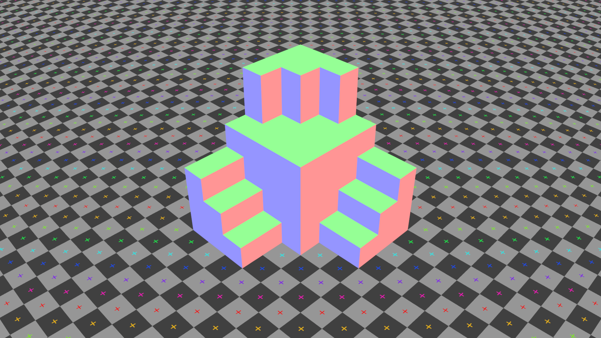

# Photogrammetry Study

## Pinhole
> 

1. A, B, C
  - Image Size: 1920 X 1080
  - Focal Length: 35mm
  - Film Back: 36 X 20.25mm
2. D
  - Image Size: 1920 X 1080
  - Focal Length: 50mm
  - Film Back: 36 X 20.25mm

## Lens Distortion
> 

1. A, B, C
  - Image Size: 1920 X 1080
  - Focal Length: 35mm
  - Film Back: 36 X 20.25mm
  - Distortion
      - Lens Distortion Model: 3DE Classic LD Model
      - Distortion: 0.1000
1. D
  - Image Size: 1920 X 1080
  - Focal Length: 50mm
  - Film Back: 36 X 20.25mm
  - Distortion
      - Lens Distortion Model: 3DE Classic LD Model
      - Distortion: -0.1000

## Pinhole No Parallax
> 

- Image Size: 1920 X 1080
- Focal Length: 35mm
- Film Back: 36 X 20.25mm

## Line-up Geo
> 
